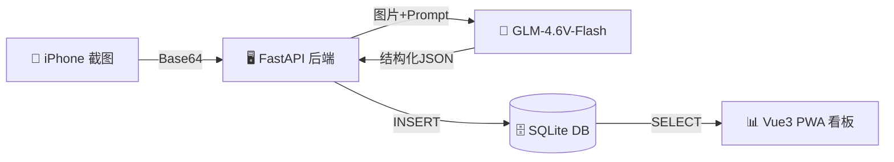
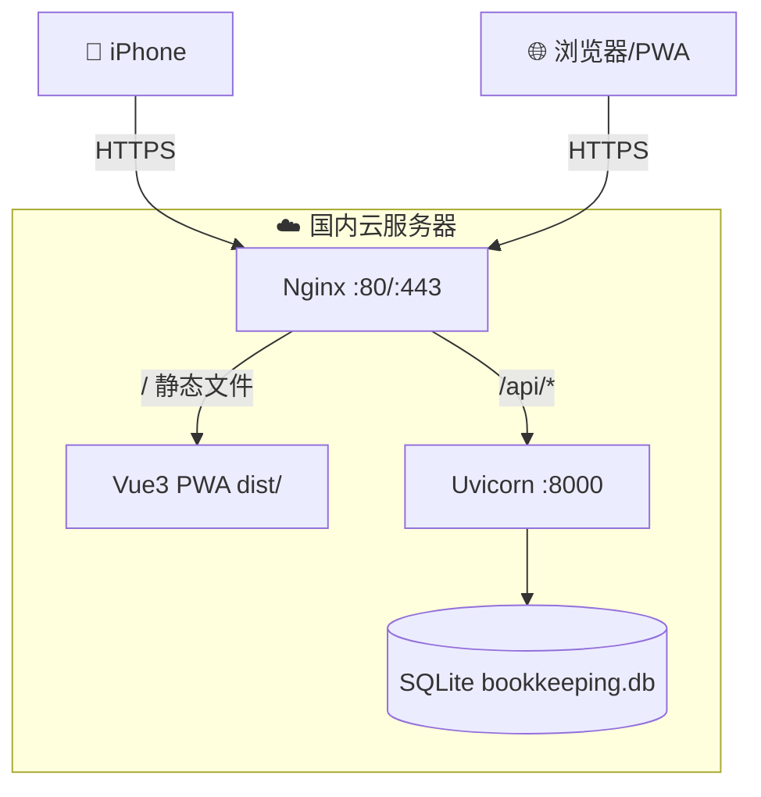

# 个人记账系统 (Self Bookkeeping) — 实施计划

## 项目概述

构建一套从 iPhone 截图到财务可视化的个人记账全链路系统：
- **输入**：iPhone 快捷指令拍照/截图 → Base64 → POST 到后端
- **处理**：FastAPI 接收图片 → 调用 GLM-4.6V-Flash 提取结构化数据 → 入库
- **展示**：Vue3 PWA 看板展示统计图表，可添加到主屏作为独立 App

---

## 数据存储方案

### 为什么选 SQLite？

| 对比项 | SQLite | MySQL |
|--------|--------|-------|
| 部署复杂度 | 零配置，单文件 | 需安装服务、配置端口 |
| 适合场景 | 个人项目、低并发 | 多用户、高并发 |
| 备份方式 | 复制 `.db` 文件即可 | 需 `mysqldump` |
| 性能 | 单用户场景完全够用 | 高并发更优 |

> [!TIP]
> 对于个人记账系统，SQLite 是最佳选择。零运维、单文件备份、无需额外进程。未来如需迁移到 MySQL，只需更换 SQLAlchemy 的连接字符串即可，业务代码无需修改。

### 数据库表设计

```sql
-- 主表：账单记录
CREATE TABLE receipts (
    id          INTEGER PRIMARY KEY AUTOINCREMENT,
    date        TEXT NOT NULL,          -- 交易日期，格式 'YYYY-MM-DD'
    merchant    TEXT NOT NULL,          -- 商家名称，如 '瑞幸咖啡'
    amount      REAL NOT NULL,          -- 金额，如 16.50
    type        TEXT NOT NULL,          -- 收支类型：'income' | 'expense'
    category    TEXT NOT NULL,          -- 分类：餐饮/交通/购物/娱乐/医疗/教育/其他
    raw_response TEXT,                  -- AI 原始返回 JSON（用于调试和审计）
    image_hash  TEXT,                   -- 图片 MD5 哈希（防重复提交）
    created_at  TIMESTAMP DEFAULT CURRENT_TIMESTAMP  -- 入库时间
);

-- 索引：加速按日期和按分类查询
CREATE INDEX idx_receipts_date ON receipts(date);
CREATE INDEX idx_receipts_category ON receipts(category);
CREATE INDEX idx_receipts_type ON receipts(type);
```

> [!IMPORTANT]
> 数据库文件 `bookkeeping.db` 存储在后端项目根目录的 `data/` 文件夹下。部署时需确保此目录有写权限。

### 数据流转示意



---

## 项目目录结构

```
e:\self_bookkeeping\
├── backend\                        # Python 后端
│   ├── main.py                     # FastAPI 入口
│   ├── models.py                   # SQLAlchemy 数据模型
│   ├── database.py                 # 数据库连接与初始化
│   ├── schemas.py                  # Pydantic 请求/响应模型
│   ├── ai_service.py              # GLM-4.6V-Flash 调用封装
│   ├── requirements.txt           # Python 依赖
│   ├── .env.example               # 环境变量模板
│   └── data\                      # 数据存储目录
│       └── bookkeeping.db         # SQLite 数据库文件（运行时生成）
│
├── frontend\                       # Vue3 PWA 前端
│   ├── index.html
│   ├── vite.config.js
│   ├── package.json
│   ├── public\
│   │   ├── manifest.json          # PWA 清单
│   │   └── icons\                 # PWA 图标
│   └── src\
│       ├── App.vue
│       ├── main.js
│       ├── api\                   # Axios 请求封装
│       │   └── index.js
│       ├── views\
│       │   ├── Dashboard.vue      # 本月概况
│       │   ├── Charts.vue         # 图表分析
│       │   └── YearlyBill.vue     # 年度账单
│       └── components\
│           ├── MonthSummary.vue    # 月度汇总卡片
│           ├── PieChart.vue       # 支出分类饼图
│           ├── BarChart.vue       # 每日支出柱状图
│           └── LineChart.vue      # 消费趋势折线图
│
└── docs\
    └── ios_shortcut_guide.md      # iOS 快捷指令配置文档
```

---

## 模块一：后端服务 (FastAPI)

### 依赖列表 (`requirements.txt`)

```
fastapi>=0.104.0
uvicorn>=0.24.0
sqlalchemy>=2.0.0
pydantic>=2.0.0
python-dotenv>=1.0.0
httpx>=0.25.0
```

### API 接口设计

#### `POST /api/upload_receipt`

接收截图 Base64，调用 AI 解析，入库。

```json
// 请求体
{
  "image_base64": "data:image/png;base64,iVBOR..."
}

// 成功响应 200
{
  "success": true,
  "message": "✅ 记账成功：瑞幸咖啡 - 16.50元",
  "data": {
    "id": 42,
    "date": "2026-02-21",
    "merchant": "瑞幸咖啡",
    "amount": 16.50,
    "type": "expense",
    "category": "餐饮"
  }
}
```

#### `GET /api/get_stats`

支持多维度统计查询：

| 参数 | 类型 | 说明 |
|------|------|------|
| `period` | string | `month` / `year` |
| `year` | int | 年份，如 2026 |
| `month` | int | 月份，1-12（period=month 时必传）|

```json
// 响应示例 (period=month)
{
  "total_expense": 3280.50,
  "total_income": 12000.00,
  "balance": 8719.50,
  "by_category": [
    { "category": "餐饮", "amount": 1580.00, "percentage": 48.1 },
    { "category": "交通", "amount": 620.00, "percentage": 18.9 }
  ],
  "daily_expense": [
    { "date": "2026-02-01", "amount": 45.00 },
    { "date": "2026-02-02", "amount": 128.50 }
  ]
}
```

#### `GET /api/get_yearly`

年度按月汇总：

```json
// 响应示例
{
  "year": 2026,
  "monthly": [
    { "month": 1, "income": 12000, "expense": 4200, "balance": 7800 },
    { "month": 2, "income": 12000, "expense": 3280, "balance": 8720 }
  ]
}
```

#### `GET /api/receipts`

分页查询账单明细，支持按日期、分类、类型筛选：

| 参数 | 类型 | 说明 |
|------|------|------|
| `page` | int | 页码，默认 1 |
| `page_size` | int | 每页条数，默认 20 |
| `start_date` | string | 起始日期 |
| `end_date` | string | 结束日期 |
| `category` | string | 分类筛选 |
| `type` | string | income / expense |

### AI Prompt 设计

```python
RECEIPT_PROMPT = """你是一个专业的账单识别助手。请分析这张支付截图，提取以下信息并以纯 JSON 格式返回：
{
  "date": "YYYY-MM-DD 格式的交易日期",
  "merchant": "商家名称",
  "amount": 数字格式的金额（不带货币符号）,
  "type": "income 或 expense",
  "category": "从以下分类中选择一个：餐饮、交通、购物、娱乐、医疗、教育、住房、通讯、其他"
}
注意：
1. 只返回 JSON，不要任何其他文字
2. 金额必须是数字，不要包含 ¥ 或 元
3. 日期如果无法从图中识别，使用今天的日期
4. 如果是红包、转账收入等，type 为 income"""
```

---

## 模块二：前端看板 (Vue3 PWA)

### 技术选型

| 技术 | 版本 | 用途 |
|------|------|------|
| Vue 3 | ^3.4 | 前端框架 |
| Vite | ^5.0 | 构建工具 |
| Element Plus | ^2.4 | UI 组件库 |
| ECharts | ^5.5 | 图表库 |
| Axios | ^1.6 | HTTP 请求 |
| vite-plugin-pwa | ^0.17 | PWA 支持 |

### 核心页面

1. **Dashboard（本月概况）**
   - 顶部三卡片：总支出 / 总收入 / 结余（带同比上月变化）
   - 中段：支出分类饼图 + 每日支出柱状图
   - 底部：最近交易列表

2. **Charts（图表分析）**
   - 消费趋势折线图（近 30 日）
   - 周对比柱状图
   - 分类TOP5排行

3. **YearlyBill（年度账单）**
   - 每月收支柱状图（收入 vs 支出堆叠）
   - 年度总结数据卡片
   - 按月展开明细

### PWA 配置要点

```json
{
  "name": "个人记账",
  "short_name": "记账",
  "display": "standalone",
  "background_color": "#0f172a",
  "theme_color": "#6366f1",
  "start_url": "/",
  "icons": [...]
}
```

---

## 模块三：iOS 快捷指令

> [!NOTE]
> 快捷指令无法通过代码直接生成，将提供详细的图文配置文档，用户在 iPhone 上手动创建。

### 配置步骤大纲

1. 打开「快捷指令」App → 新建快捷指令
2. 添加「获取最新照片」操作（或接收分享输入）
3. 添加「Base64 编码」操作
4. 添加「获取 URL 内容」操作：
   - Method: POST
   - URL: `https://your-server.com/api/upload_receipt`
   - Headers: `Content-Type: application/json`
   - Body: `{"image_base64": [Base64结果]}`
5. 添加「获取词典值」提取返回的 `message`
6. 添加「显示通知」展示结果

---

## 验证计划

### 自动化测试

1. **后端单元测试**
   ```bash
   cd e:\self_bookkeeping\backend
   python -m pytest tests/ -v
   ```
   - 测试数据库 CRUD 操作
   - 测试 AI 返回 JSON 解析与清洗逻辑
   - 测试统计 API 的聚合计算

2. **后端接口测试**
   ```bash
   cd e:\self_bookkeeping\backend
   uvicorn main:app --reload --port 8000
   # 然后访问 http://localhost:8000/docs 使用 Swagger 交互式测试
   ```

### 浏览器测试

1. 启动前后端后，通过浏览器工具访问 `http://localhost:5173`
2. 验证 Dashboard 页面图表是否正确渲染
3. 验证分类饼图数据是否与 API 返回一致
4. 测试响应式布局（手机尺寸模拟）

### 手动验证

1. 用户使用示例支付截图调用 `/api/upload_receipt` 接口
2. 检查数据库中是否正确写入记录
3. 刷新前端看板确认新数据是否实时展示
4. 在 iPhone 真机上测试快捷指令完整流程

---

## 部署备注



- Nginx 反向代理：前端静态文件 + 后端 API 统一入口
- HTTPS 证书：Let's Encrypt 免费证书
- 后端进程管理：使用 `systemd` 或 `supervisor` 守护 uvicorn
